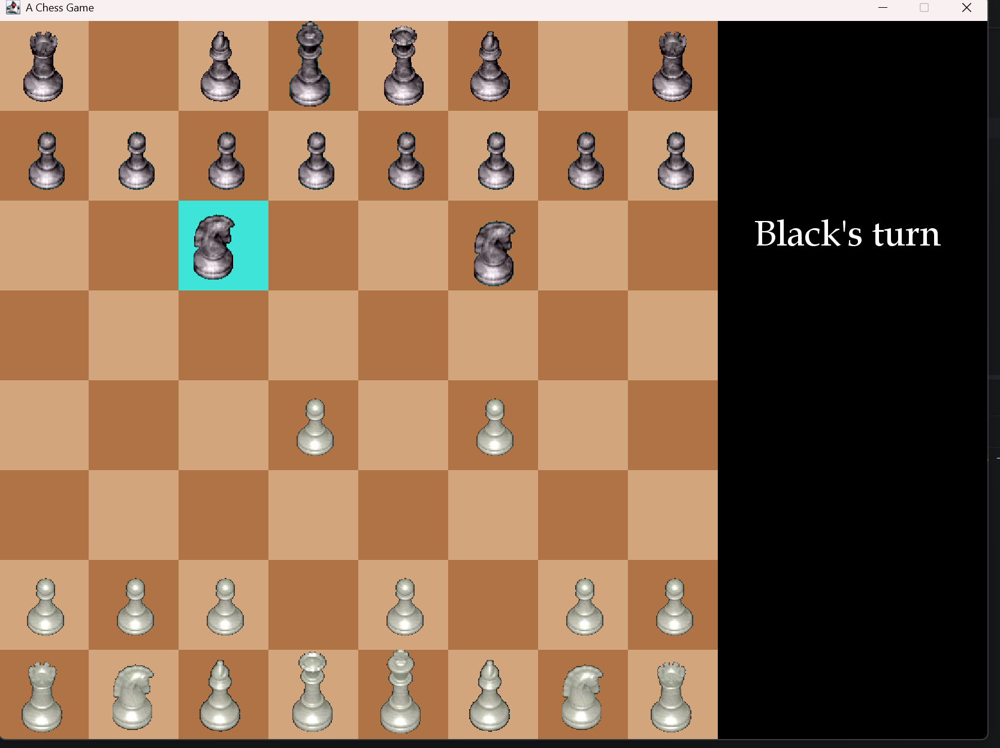

## JPChess 

Un jeu d'échecs en Java avec interface graphique, développé pour approfondir mes compétences en programmation orientée objet et en conception de logiciels.


## Description


JPChess est une implémentation complète du jeu d'échecs, incluant :
- Un plateau de jeu interactif avec interface graphique (Swing)
- La gestion de tous les types de pièces (Roi, Reine, Tour, Fou, Cavalier, Pion) avec leurs règles de déplacement spécifiques
- La détection des mouvements via la souris
- Une architecture orientée objet claire, séparant la logique du jeu (modèle) et l'affichage (vue).

Technologies utilisées dans le cadre du projet :

- **Java**
- **Swing** — interface graphique
- Architecture orientée objet (héritage, polymorphisme)


## Structure du projet

```
JPChess/
├── src/
│   ├── jpchess/
│   │   ├── JPChess.java       # Point d'entrée du programme
│   │   ├── Board.java         # Gestion du plateau
│   │   ├── ChessBoard.java    # Logique de l'échiquier
│   │   ├── Mouse.java         # Gestion des interactions souris
│   │   └── Type.java          # Types/énumérations du jeu
│   ├── Piece/
│   │   ├── Piece.java         # Classe abstraite des pièces
│   │   ├── Roi.java
│   │   ├── Reine.java
│   │   ├── Tour.java
│   │   ├── Fou.java
│   │   ├── Cavalier.java
│   │   └── Pion.java
│   └── res/                   # Images des pièces
```


## Comment lancer le projet

1. Clone le repository :
```bash
git clone https://github.com/JN-stj/JPChess.git
```
2. Ouvre le projet dans IntelliJ IDEA (ou l'IDE de ton choix)
3. Lance la classe `JPChess.java` (contient la méthode `main`)


## Aperçu




## Fonctionnalités

- [x] Affichage du plateau et des pièces
- [x] Déplacement des pièces à la souris
- [X] Validation complète des règles d'échecs (échec, échec et mat)
- [ ] Historique des coups
- [ ] Mode deux joueurs en ligne


## Auteur

**JN-stj**
[GitHub](https://github.com/JN-stj)

---

*Projet réalisé dans le cadre de mon apprentissage en programmation Java / génie logiciel.*
